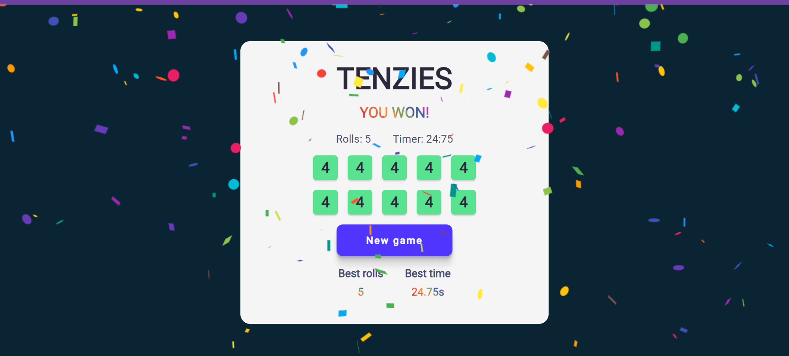

# [Tenzies Game](https://tenzies-byhannah.netlify.app/)
This is a solution to the Tenzies Game project

## Table of Contents
- [Overview](#overview)
  - [The challenge](#the-challenge)
  - [Screenshot](#screenshot)
  - [Links](#links)
  - [Getting Started with Create React App](#getting-started-with-create-react-app)
  - [Built with](#built-with)
  - [Extra Features](#extra-features)
  - [Useful resources](#useful-resources)
- [Author](#author)

## Overview

### The Challenge

Create a Tenzies Game using the React.JS framework and its functionalities

### Screenshot

### Links

- Live Site URL: [@Netlify](https://tenzies-byhannah.netlify.app/)
- Solution URL: [@GitHub](https://github.com/hannahpietersen/tenzies-game)

### Getting Started with Create React App

This project was bootstrapped with [Create React App](https://github.com/facebook/create-react-app).

### Built with

- Semantic HTML5 markup
- CSS custom properties
- Flexbox
- React.JS

### Useful resources

- [ReactJS](https://reactjs.org/tutorial/tutorial.html) - How to set up a local development environment on your computer
- [StackOverflow](https://stackoverflow.com/questions/71743492/issue-importing-createroot-from-react-dom-client) - Issue importing ReactDOM from 'react-dom'
-  [Nanoid @Github](https://github.com/ai/nanoid#react)
-  [Confetti @Github](https://github.com/alampros/react-confetti)
-  [Ray Alva](https://medium.com/codex/react-stopwatch-10bf9813d0ec) - React Stopwatch

  ## Author

- Website - [Hannah Kongara](https://hannahkongara.netlify.app/)
 
